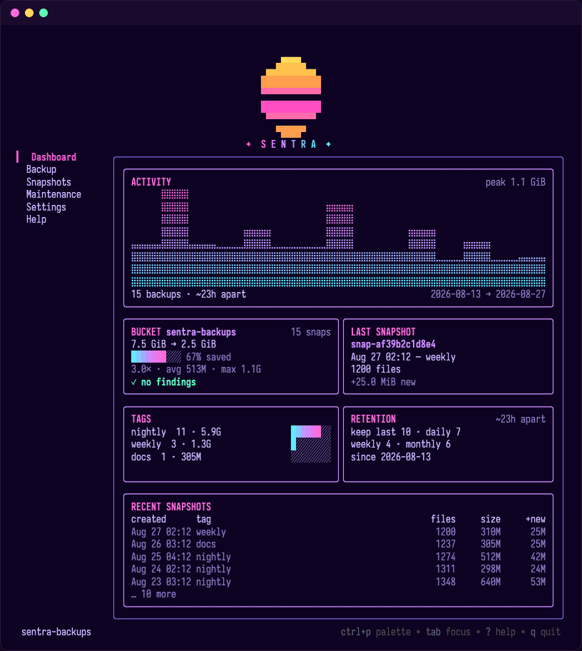
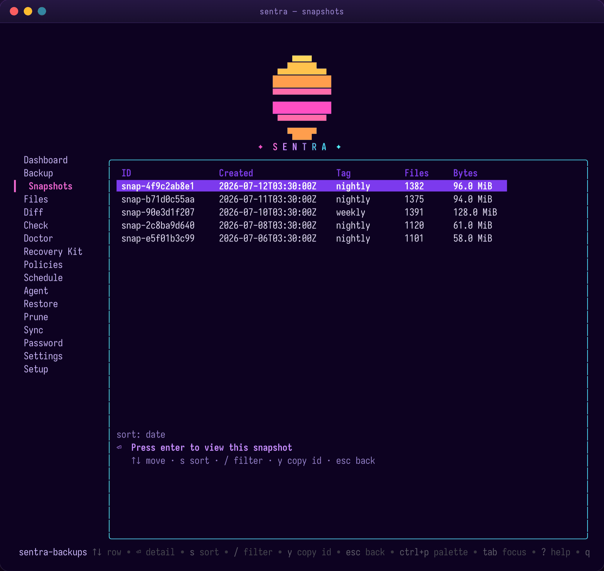
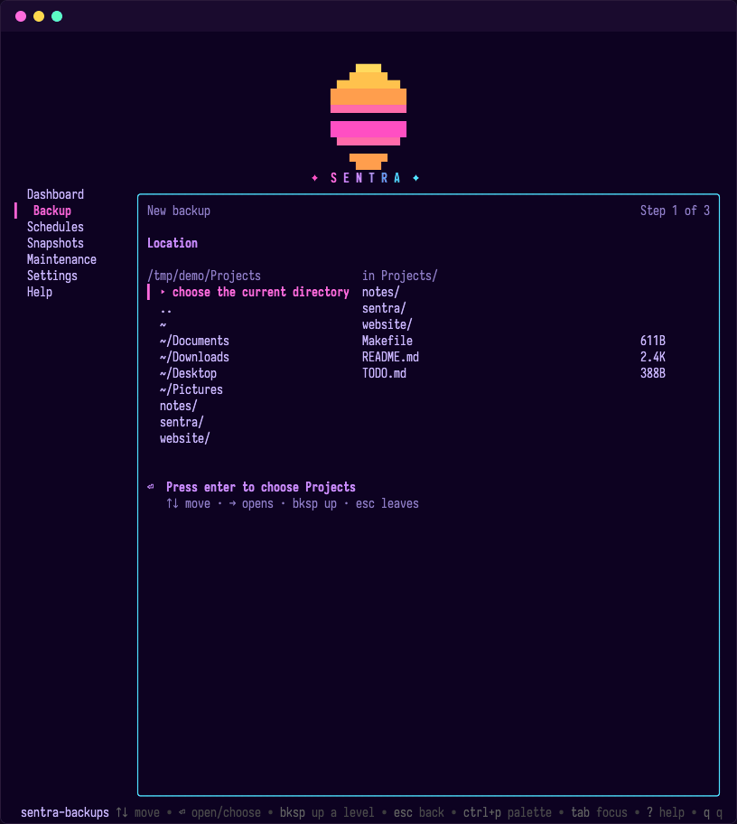
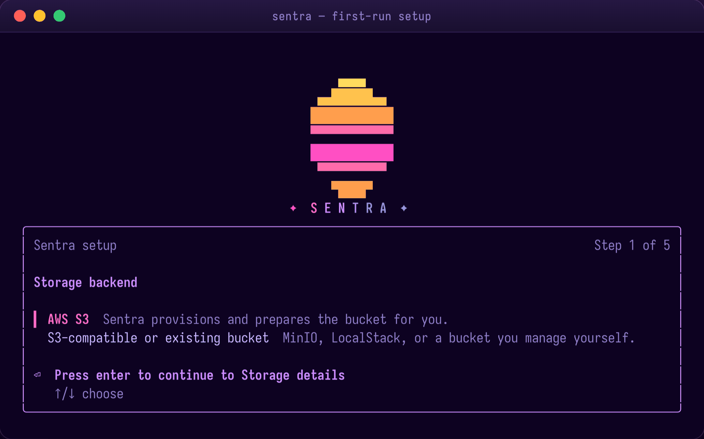
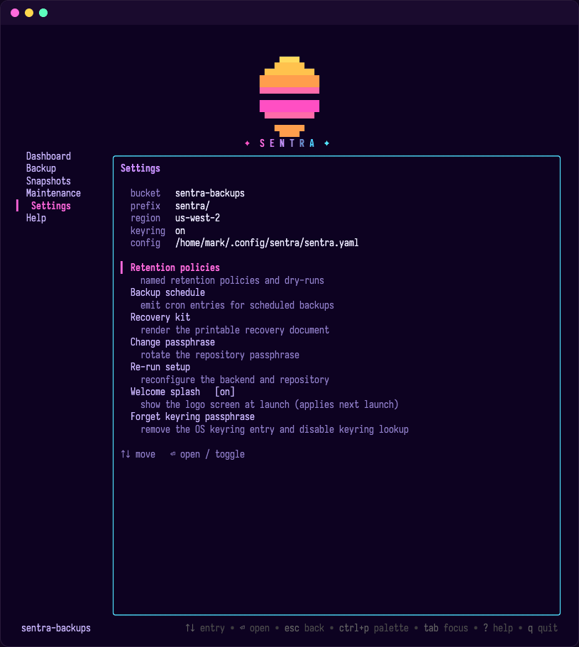

<div align="center">

# ✦ S E N T R A ✦

**Encrypted, deduplicated, agent-aware backups for S3 — driven from a synthwave terminal.**

[](https://github.com/markgustetic/sentra/actions/workflows/ci.yml)
[](go.mod)
[](LICENSE)
[](#security)
[](#quickstart)



<sub>The default surface is a full-screen TUI — a seven-view rail, a first-run wizard, and every human workflow at your fingertips.</sub>

</div>

---

## What is Sentra?

Sentra is a **single Go binary** (`sentra`) that backs up local directories to
S3 or any S3-compatible store as **encrypted, content-addressed snapshots**. It
runs equally well as a scriptable CLI or a full-screen TUI, and it ships with a
built-in agent that audits your repository and surfaces recommendations.

- 🔒 **Client-side encryption.** New blobs are sealed with XChaCha20-Poly1305
  using a per-blob 24-byte random nonce; the data key is derived from your
  passphrase with Argon2id. **The bucket only ever sees ciphertext.**
- 🧩 **Content-defined dedup.** FastCDC chunking + SHA-256 content addressing.
  A 50 GiB tree with one changed file uploads roughly **1 MiB** on the next
  snapshot.
- 🗂️ **Versioned snapshots.** Each snapshot is an immutable, encrypted manifest
  pointing at chunk hashes. Restore re-derives and verifies every hash, so it is
  **exact-byte by construction**.
- 🤖 **A hybrid agent.** Local heuristics run first; the optional LLM sees
  **summaries only — never file contents or secret values**. Recommendations are
  read-only by default (prune candidates, ignore-list additions, secret
  findings, retention drift).
- 🔌 **MCP built in.** `sentra mcp` serves your snapshots to Claude — or any
  MCP client — over stdio: metadata only, with two-phase confirm-gated
  mutations. Inside the TUI, `ctrl+a` opens a built-in assistant chat with
  the same guarantees.
- 🌆 **A synthwave TUI.** `sentra ui` — or just `sentra` — opens a Bubbletea app
  that lands on a first-run wizard, an unlock gate, or the dashboard depending on
  your state.

## A quick tour

<table>
  <tr>
    <td width="50%" valign="top" align="center">
      
      <br><sub><b>Snapshots</b> — sort, filter, drill in; <code>r</code> restores and <code>d</code> diffs the highlighted row.</sub>
    </td>
    <td width="50%" valign="top" align="center">
      
      <br><sub><b>Backup</b> — pick a folder (with jump-to places), tag it, and arm a daily/weekly/monthly schedule.</sub>
    </td>
  </tr>
  <tr>
    <td width="50%" valign="top" align="center">
      
      <br><sub><b>First-run wizard</b> — guided setup for AWS or any S3-compatible store.</sub>
    </td>
    <td width="50%" valign="top" align="center">
      
      <br><sub><b>Settings</b> — config summary plus scheduled backups, recovery kit, passphrase, and setup.</sub>
    </td>
  </tr>
</table>

## Install

<details open>
<summary><b><code>go install</code></b></summary>

```bash
go install github.com/markgustetic/sentra/cmd/sentra@latest
```

Builds from source with your Go toolchain (1.27+); `sentra version` reports
the module version and commit from the embedded build info.
</details>

<details>
<summary><b>Homebrew</b> (from tagged releases)</summary>

```bash
brew install markgustetic/tap/sentra
```
</details>

<details>
<summary><b>Docker (GHCR)</b> (from tagged releases)</summary>

```bash
docker pull ghcr.io/markgustetic/sentra:latest
docker run --rm -v "$PWD:/work" -w /work ghcr.io/markgustetic/sentra:latest --version
```
</details>

<details>
<summary><b>Prebuilt binaries (signed)</b> (from tagged releases)</summary>

Download platform archives (macOS and Linux, amd64/arm64) from the
[releases page](https://github.com/markgustetic/sentra/releases). Each release
ships a `checksums.txt` plus a cosign keyless signature (`checksums.txt.sig` and
`checksums.txt.pem`) and a syft SBOM per archive. The certificate identity is
the exact release-workflow path bound to a tag ref — substitute the version you
downloaded:

```bash
cosign verify-blob \
  --certificate checksums.txt.pem \
  --signature  checksums.txt.sig \
  --certificate-identity 'https://github.com/markgustetic/sentra/.github/workflows/release.yml@refs/tags/<version>' \
  --certificate-oidc-issuer https://token.actions.githubusercontent.com \
  checksums.txt
```
</details>

## Quickstart

### 🚀 Fastest: kick the tires with local MinIO (no AWS account)

`sentra local` starts a local MinIO via docker compose, points Sentra at a
throwaway `.sentra-local.yaml` (never your real config), and opens the TUI with
the first-run wizard pre-filled for MinIO. It runs `docker compose` in the
current directory, so run it **from a clone of this repo** (which carries the
`docker-compose.yaml`):

```bash
git clone https://github.com/markgustetic/sentra && cd sentra
just local            # builds the binary and opens the TUI (needs Docker)
```

`just local-reset` wipes everything back to a clean first run.

### 🪣 Real storage: the setup wizard

For AWS S3 or any S3-compatible store, let the wizard do the work:

```bash
sentra setup
```

It walks you through the backend choice, can **create or verify the bucket,
block public access, enable default encryption, write `sentra.yaml`, and
initialize the encrypted repo** — all in one flow, reviewing a non-secret plan
before it touches anything.

- **AWS S3** → sign in with AWS CLI browser login (the default), IAM Identity
  Center / SSO, an existing profile/role, or write config only. After a
  browser or SSO sign-in the wizard offers to **create a dedicated backup
  user** — a scoped IAM user whose static keys never expire — and switches
  your config to it, so scheduled backups survive the night. Browser login
  alone is for trying Sentra: its session expires within hours. Need an admin
  to grant permissions first? The wizard can print the least-privilege IAM
  policy and stop:

  ```bash
  sentra setup iam-policy --bucket my-backups --prefix sentra/
  ```

- **S3-compatible or existing bucket** (MinIO, LocalStack, Cloudflare R2,
  Wasabi, …) → enter the bucket, region, and `endpoint_url` and you're set.

When it initializes the repo, Sentra asks you to set a repository passphrase
(unless `--passphrase-file` or `SENTRA_PASSPHRASE` supplies one). Choose **Save
in keychain** and Sentra stores it in your OS keyring, writing only
`passphrase.use_keyring: true` to `sentra.yaml` — **never the secret itself**.

> [!NOTE]
> **No secrets are ever written to `sentra.yaml`, logs, setup drafts, or
> recovery kits.** Not the passphrase, not wrapped keys, not AWS credentials.

### 📸 Take a snapshot

```bash
sentra backup ./Documents --tag weekly
```

Repeating a backup? Save the path and maintenance choices as a **policy**, then
install it into your OS user scheduler (launchd on macOS, systemd user
timers on Linux — no resident daemon):

```bash
sentra policy add home --path ./Documents --tag home --schedule daily@03:00 --check --prune dry-run
sentra policy run home
sentra schedule install home
sentra schedule status home
```

Want a reviewed, two-step run? Write a JSON plan, inspect it, then apply:

```bash
sentra backup plan  ./Documents --tag weekly --out weekly-plan.json
sentra backup apply weekly-plan.json
```

### 🔍 List, restore, verify

```bash
sentra snapshots                         # newest first; --json for scripting
sentra restore <snapshot-id> /tmp/out --dry-run   # preview, writes nothing
sentra restore <snapshot-id> /tmp/out --verify    # restore + re-check chunk hashes
sentra check                             # audit manifests, chunk refs, orphans, stale locks
sentra recovery-kit --out sentra-recovery-kit.md  # non-secret restore notes
```

### 🤖 Ask the agent

```bash
sentra agent advise-ignore ./Documents            # suggest .sentraignore patterns (read-only)
sentra agent scan --local-only --root ./Documents # heuristics only, no LLM
sentra agent scan --apply                          # review + apply recommendations interactively
```

### 🔌 Serve it to your AI (MCP)

`sentra mcp` runs a [Model Context Protocol](https://modelcontextprotocol.io)
server on stdio, so Claude (or any MCP client) can work with your backups —
**metadata only, never file contents**, and every mutation is two-phase:
the client gets a plan and a single-use token, and nothing runs until the
matching `confirm_*` call.

```bash
claude mcp add sentra -- sentra mcp
```

Tools: `list_snapshots`, `snapshot_files`, `find`, `diff_snapshots`,
`repo_stats`, plus `plan_backup`/`confirm_backup` and
`plan_restore`/`confirm_restore`. The passphrase must resolve
non-interactively (keyring, `SENTRA_PASSPHRASE`, or `--passphrase-file`) —
stdio belongs to the protocol.

The TUI carries its own assistant with the same boundary: `ctrl+a` opens a
chat overlay (needs `ANTHROPIC_API_KEY`) whose actions compile into the exact
flows the keyboard drives — a chat-requested backup raises the same confirm
dialog you'd get pressing enter yourself.

The full walkthrough lives in [`docs/QUICKSTART.md`](docs/QUICKSTART.md).

## The TUI

Bare `sentra` falls through to `sentra ui`. Where it lands depends on your state:
**no `sentra.yaml` → first-run wizard**, **configured but locked → unlock gate**,
otherwise **the dashboard**. The rail holds seven destinations — Dashboard,
Backup, Scheduled backups, Snapshots, Maintenance, Settings, Help — and the
occasional jobs live one keypress inside them: restore and diff launch from a
snapshot row, check/prune/sync/doctor from Maintenance, recovery-kit/
passphrase/setup from Settings. Backup is a three-step wizard: pick the
folder, pick a schedule (one-shot, or hourly/daily/weekly/monthly — that
installs a named policy plus a launchd/systemd timer), confirm.

Handy keys (the status bar always shows what's live):

| Key | Action |
| --- | --- |
| `↑` / `↓` · digits | Move the nav rail · jump straight to a view |
| `tab` | Toggle focus between the rail and the content pane |
| `enter` · `esc` | Trigger the primary action · go back |
| `ctrl+p` | Command palette |
| `ctrl+a` | Assistant chat — ask questions, or say what to do (actions still confirm) |
| `r` · `d` (in Snapshots) | Restore · diff the highlighted snapshot |
| `enter` · `esc` (in Backup) | Next wizard step · back a step |
| `enter` · `e` · `d` (in Scheduled backups) | Drill into a job's files · edit · delete (policy + timer) |
| `?` · `q` | Help · quit |

> Selection is carried by a `▍` glyph, not just color, and the neon strips
> cleanly under `NO_COLOR`, a pipe, or a 2-color terminal — the synthwave look is
> a dark-terminal flourish, never a legibility risk.

## Commands

| Command | What it does |
| --- | --- |
| `sentra ui` | Launch the full-screen TUI. Bare `sentra` is equivalent. |
| `sentra local` | Dev flow: start local MinIO and open the wizard-prefilled TUI. |
| `sentra setup` | Guided wizard for AWS/S3 config, bucket prep, and repo init. |
| `sentra setup iam-policy` | Print non-secret AWS IAM JSON for a bucket/prefix. |
| `sentra doctor` | Check config, AWS access, bucket settings, and repo health — read-only. |
| `sentra init` | Non-interactively create `sentra.yaml` and the encrypted repo config. |
| `sentra backup <path>` | Snapshot a directory now. `--tag` labels it. `plan`/`apply` for reviewed runs. |
| `sentra snapshots` | List snapshots, newest first. `--json` for scripting. |
| `sentra ls <snap>` | List a snapshot's tree: files, dirs, symlink targets. |
| `sentra restore <snap> <dest> [path…]` | Restore a snapshot — or just the named files/subtrees. `--dry-run` previews; `--verify` validates output. |
| `sentra diff <a> <b>` | Show added / removed / changed paths between two snapshots. |
| `sentra check` | Audit manifests, chunk references, orphan blobs, and stale locks. `--read-data` re-downloads and re-hashes chunks. |
| `sentra stats` | Dedup factor, logical vs stored bytes, per-snapshot unique footprint. |
| `sentra pin` / `unpin` | Protect a snapshot from prune and deletion. |
| `sentra prune` | Dry-run retention by default; `--apply` reclaims, `--explain` shows reasons. |
| `sentra policy …` | Manage named backup policies (`add`/`list`/`show`/`remove`/`run`); removing a policy also uninstalls its OS timer. |
| `sentra schedule …` | Install user-level OS schedules for named policies. |
| `sentra password` | Rotate or forget the repository passphrase (`passwd` is an alias). |
| `sentra sync --dst-config` | Replicate this repo to a clone destination (additive; `--snapshot` selects a subset). |
| `sentra recovery-kit` | Export non-secret recovery notes and restore commands. |
| `sentra agent advise-ignore` | Suggest first-run `.sentraignore` patterns without editing files. |
| `sentra agent scan` | Heuristics + optional LLM. `--local-only`, `--root`, `--categories`, `--apply`. |

Every subcommand resolves the passphrase in this order:
**`--passphrase-file`** → **`SENTRA_PASSPHRASE`** → **OS keyring** (when
`passphrase.use_keyring: true`) → **interactive prompt** (TTY only). Keyring
entries are scoped to the configured bucket **and** prefix, so multiple repos can
safely share one bucket under different prefixes.

## Configuration

Sentra looks for `sentra.yaml` in the current directory first, then falls
back to `~/.config/sentra/sentra.yaml` (honoring `XDG_CONFIG_HOME`).
First-run setup writes the home location, so after setting up once you
can run `sentra` from any directory. Pass `--config` to use a specific
file; it must already exist (`sentra setup --config <path>` creates one).

`sentra.yaml` holds non-secret settings only. A `.sentraignore` at the walk root
applies gitignore-style globs (a starter ships at
[`.sentraignore.example`](.sentraignore.example)). The Anthropic provider needs
`ANTHROPIC_API_KEY`; without it every non-agent command still works and
`sentra agent scan` returns a clear error.

```yaml
repo:
  s3:
    bucket: my-backups            # required
    prefix: sentra/               # optional — lets multiple repos share a bucket
    region: us-west-2             # optional — falls back to the AWS SDK chain
    profile: default              # optional — AWS shared-credentials profile
    endpoint_url: ""              # optional — set for MinIO / LocalStack / R2 / Wasabi
    storage_class: ""             # optional — e.g. STANDARD_IA or GLACIER_IR

agent:
  provider: anthropic
  model: claude-sonnet-4-6
  max_findings_to_llm: 50         # cap on prompt size

backup:
  ignore_file: .sentraignore
  exclude_caches: true            # honor CACHEDIR.TAG
  concurrency: 0                  # 0 = auto; parallel file scan/upload workers
  max_upload_rate: ""             # optional throttle, e.g. 10MiB

ui:
  hide_splash: false              # skip the launch splash

retention:
  keep_last: 10
  keep_daily: 7
  keep_weekly: 4
  keep_monthly: 6

passphrase:
  use_keyring: false              # true means future commands read the OS keyring

policies:
  home:
    paths: ["~/Documents"]
    tags:  ["home"]
    schedule: { cadence: daily, at: "03:00" }
    after_backup: { check: true, prune: dry-run }   # prune: off | dry-run | apply
```

## Security

Sentra is a backup tool, so it's worth being explicit about what the encryption
protects — and what it doesn't. The [threat model](docs/threat-model.md) has the
full write-up; the load-bearing invariants:

- **Encryption.** New blobs use XChaCha20-Poly1305 with a per-blob 24-byte random
  nonce and the version byte bound as associated data. A nonce is never reused
  under a key, and the bucket never sees plaintext.
- **Content addressing.** A chunk's key is the SHA-256 of its raw (decompressed)
  plaintext. Restore re-derives and checks it on read, so restore is exact-byte.
- **GC safety.** GC computes its live set from the snapshots present in the store
  under the repo lock — never from a caller-supplied set — so a blob referenced by
  any present manifest is never reaped.
- **One repo lock.** `backup`, `GC`, `sync`, `passwd`, and snapshot-apply
  serialize on an advisory `meta/lock` (atomic put-if-absent). Release is
  fail-closed.
- **Agent boundary.** The LLM sees summaries only, never file contents or secret
  values; recommendations are read-only by default.

**Protects:** file contents, file paths, manifest metadata, snapshot tags.
**Leaks:** object counts and approximate sizes (compress-then-encrypt), S3 access
logs. **Out of scope:** forward secrecy across passphrase compromise, post-quantum
key strength.

## Architecture

See [`docs/architecture.md`](docs/architecture.md) for the storage model, the
agent loop, and Mermaid diagrams of the `backup`, `restore`, and `agent scan`
flows. In one breath: a snapshot is an encrypted manifest of SHA-256 chunk hashes;
chunks are FastCDC-split, zstd-compressed, then sealed; dedup falls out of content
addressing; and both the CLI and TUI drive the same core in `internal/repo`.

## Development

Go **1.27+** is required, and the codebase is `internal/`-only (no public API in
v1). Prefer `just`:

```bash
just build        # → bin/sentra
just local        # build + open the TUI against local MinIO (the easy path)
just check        # build, race tests, vet, lint, vuln, tidy/gofmt/diff checks
just test         # go test -race with coverage
just integration  # testcontainers + MinIO (needs Docker; Linux)
```

The vendored FastCDC is a **separate module** — test it with
`go test ./third_party/fastcdc-go/...` when you touch chunking. CI enforces
`go mod tidy -diff`, gofmt over `cmd/` and `internal/`, `go vet`, `go test -race`,
the FastCDC module tests, `golangci-lint`, the integration suite
(testcontainers + MinIO), and an every-commit-builds job that checks out and
compiles each pushed commit in isolation — a green run vouches for the whole
series, not just the tip.

## Releasing

Push a `v*` tag to trigger [`release.yml`](.github/workflows/release.yml):
goreleaser cross-compiles `linux/darwin × amd64/arm64` archives, writes a
SHA-256 `checksums.txt`, signs it with cosign keyless (GitHub OIDC), builds a
multi-arch GHCR image, updates the Homebrew tap, and attaches a syft SBOM per
archive. The Homebrew step publishes only when the `HOMEBREW_TAP_TOKEN` secret
(`contents: write` on `markgustetic/homebrew-tap`) is present — without it the
cask is skipped and everything else still ships. `GITHUB_TOKEN` is provided
automatically.

## License

[MIT](LICENSE).

<div align="center"><sub>✦ built to keep your bytes safe, and to look good doing it ✦</sub></div>
