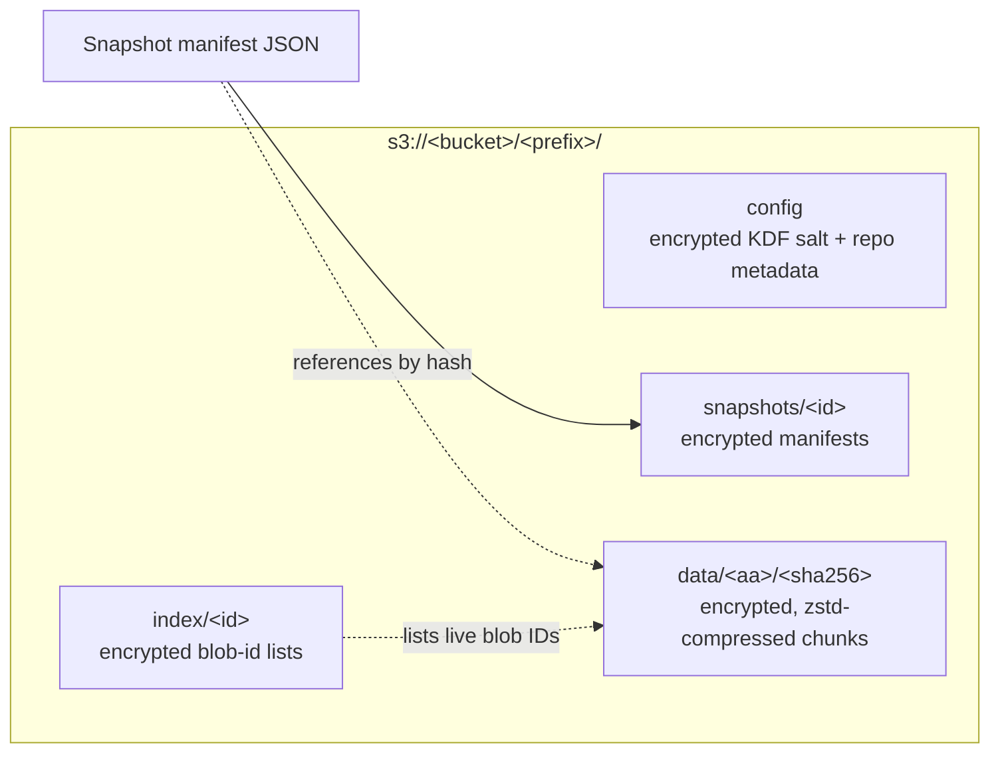
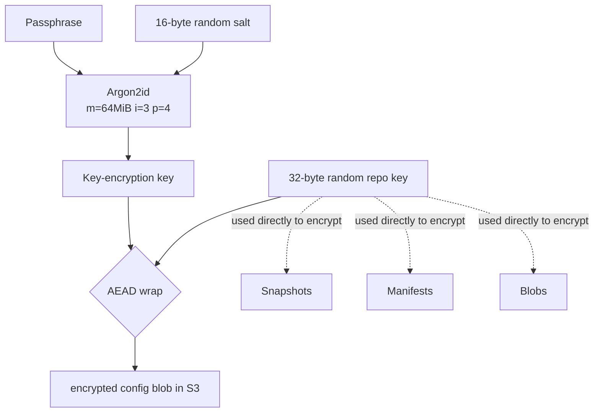

# Architecture

This doc walks through the storage model and the three core flows
(`backup`, `restore`, `agent scan`). For the why behind these decisions,
see the design doc in `docs/plans/2026-05-02-sentra-design.md`.

## Module layout

```
sentra/
├── cmd/sentra/main.go          # entrypoint, wires Cobra commands to deps
├── internal/
│   ├── cli/                    # one file per subcommand
│   ├── repo/                   # snapshot manifests + blob refs + indices
│   ├── blobstore/              # interface + S3 + in-memory test impl
│   ├── crypto/                 # XChaCha20-Poly1305 + Argon2id key derivation
│   ├── chunker/                # FastCDC + zstd
│   ├── walker/                 # concurrent fs walk + .sentraignore
│   ├── agent/
│   │   ├── heuristics/         # local rules
│   │   ├── llm/                # Provider interface + Anthropic + fake
│   │   └── tools/              # tool-use schema for the agent loop
│   ├── tui/                    # Bubbletea models + lipgloss theme
│   ├── ui/                     # shared styled components
│   └── config/                 # sentra.yaml parsing
└── .goreleaser.yaml .github/workflows/{ci,release}.yml
```

`internal/` only — the v1 surface area is the CLI, not a Go API.

## Storage model



Every object in S3 is ciphertext. The on-disk blob format is:

```
[1 byte version][24 byte nonce][XChaCha20-Poly1305(zstd(plaintext))][16 byte tag]
```

zstd-then-encrypt: encrypted output is incompressible, so the order
matters.

## Key derivation

A single `init` derives the repo key once; every subsequent command
unwraps it from the encrypted `config` object.



The indirection (passphrase → KEK → repo key) means `sentra password`
rewrites only the `config` object, never the data.

## Backup flow

```mermaid
sequenceDiagram
    participant U as User
    participant CLI as sentra backup
    participant W as walker
    participant C as chunker (FastCDC + zstd)
    participant E as crypto
    participant B as blobstore (S3)
    participant R as repo

    U->>CLI: sentra backup ./Documents
    CLI->>W: walk root + apply .sentraignore
    W-->>CLI: stream of file metadata
    loop per file
        CLI->>C: stream content → chunks
        loop per chunk
            CLI->>E: zstd then XChaCha20-Poly1305 with repo key
            E->>B: PUT data/&lt;aa&gt;/&lt;sha256&gt;<br/>(skip if exists — content addressed)
        end
    end
    CLI->>R: assemble manifest JSON
    CLI->>E: zstd + encrypt manifest
    E->>B: PUT snapshots/&lt;id&gt;
    CLI->>B: optionally PUT index/&lt;id&gt; with the live blob list
    CLI-->>U: snapshot id + stats (files, bytes, new bytes)
```

Dedup is implicit: identical chunks across files and snapshots map to
the same `data/<aa>/<sha256>` key, so the second snapshot only uploads
chunks whose content actually changed.

For reviewed backups, `sentra backup plan <path> --out plan.json` runs
the same walk and writes sorted file metadata (path, size, mode, mtime)
to JSON without opening the repository. `sentra backup apply plan.json`
validates the current tree still matches that reviewed plan before it
runs the chunk/encrypt/upload portion of the flow.

## Restore flow

```mermaid
sequenceDiagram
    participant U as User
    participant CLI as sentra restore
    participant B as blobstore (S3)
    participant E as crypto
    participant FS as local fs

    U->>CLI: sentra restore &lt;snap-id&gt; /tmp/restored
    CLI->>B: GET snapshots/&lt;snap-id&gt;
    B-->>CLI: encrypted manifest
    CLI->>E: AEAD decrypt + zstd inflate
    E-->>CLI: manifest with file tree + chunk hashes per file
    loop per file
        loop per chunk hash
            CLI->>B: GET data/&lt;aa&gt;/&lt;sha256&gt;
            B-->>CLI: encrypted chunk
            CLI->>E: AEAD decrypt + zstd inflate
            CLI->>FS: write chunk to file
        end
        CLI->>FS: chmod / chtimes per manifest
    end
    CLI-->>U: restore complete (file/byte counts)
```

By construction, restore is byte-identical: every chunk is verified by
its SHA-256 (the address) and the manifest's stat metadata is replayed.

## Agent scan flow

```mermaid
sequenceDiagram
    participant U as User
    participant Orch as agent.Orchestrator
    participant H as heuristics
    participant Prov as llm.Provider
    participant Tools as agent tools

    U->>Orch: sentra agent scan [--apply]
    par run all heuristics
        Orch->>H: secrets, large_files, cache_dirs,<br/>stale_paths, dup_paths,<br/>orphan_blobs, retention_drift
        H-->>Orch: []Finding
    end

    Orch->>Orch: cap to max_findings_to_llm

    Orch->>Prov: Generate(sys, msgs[findings], tools, stream)
    loop tool-use budget &le; 10
        Prov-->>Orch: ToolCall(list_snapshots / snapshot_stats /<br/>diff_snapshots / inspect_finding)
        Orch->>Tools: dispatch on read-only tool
        Tools-->>Orch: result
        Orch->>Prov: append tool result, continue
    end
    Prov-->>Orch: []Recommendation (Action, Target, Severity, Rationale)

    alt --apply
        loop per recommendation
            Orch->>U: huh confirm
            U-->>Orch: yes / no / quit
            Orch->>Orch: dispatch action (prune, ignore, ...)
        end
    else no flag
        Orch-->>U: print recommendations table
    end
```

Two important rails on the agent loop:

- The LLM never sees file contents. Heuristics collect typed findings;
  the prompt receives a **summary** of those findings, never bytes.
- The LLM never executes anything. It emits `[]Recommendation`, and
  only `--apply` plus an interactive `huh` confirm dispatches the
  action — and even then, only against a fixed allowlist of
  read-or-prune actions.

## TUI architecture

`sentra ui` (and bare `sentra`) launches a single Bubbletea program
with one parent `App` model and one `tea.Model` per view (dashboard,
snapshots, diff, restore, …). The rail lists six destinations; the
other views stay registered but hidden, launched from a parent
(Snapshots, Maintenance, Settings) via `activateMsg` routing. Inline-
mode commands and the TUI both pull from `internal/ui` for theme +
reusable styled components, so the visual language is consistent
across both surfaces.

The agent (`sentra agent scan`) is CLI-only: local heuristics first,
LLM summaries second, recommendations printed with confirm-gated
apply.
